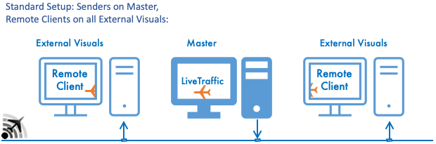

XPMP2 Remote Client
=========

**Synchronizing Planes across the Network**

Planes displayed in X-Plane using [XPMP2](https://github.com/TwinFan/XPMP2)
can by synchronized across the network.
The **XPMP2 Remote Client** needs to run on all remote computers,
receives aircraft data from any number of XPMP2-based plugins anywhere
in the network, and displays the aircraft using the same CSL model,
at the same world location with the same animation dataRefs.

This supports usage in setups like
- [Networking Multiple Computers for Multiple Displays](https://x-plane.com/manuals/desktop/#networkingmultiplecomputersformultipledisplays),
- [Networked Multiplayer](https://x-plane.com/manuals/desktop/#networkedmultiplayer),
- but also just locally as a **TCAS Concentrator**, which collects plane
  information from other local plugins and forwards them combined to TCAS
  and classic multiplayer dataRefs for 3rd party add-ons.

One of many possible setups:

Download latest official version [from X-Plane.org](https://forums.x-plane.org/index.php?/files/file/67797-xpmp2-remote-client/).

For end user documentation refer to
[LiveTraffic/XPMP2 Remote Client](https://twinfan.gitbook.io/livetraffic/setup/installation/xpmp2-remote-client)
documentation.

For more technical background information refer to
[GitHub XPMP2 documentation](https://twinfan.github.io/XPMP2/Remote.html).

Building this software is done essentially the same way as documented for `XPMP2-Sample`
in the [Building XPMP2 documentation](https://twinfan.github.io/XPMP2/Building.html).